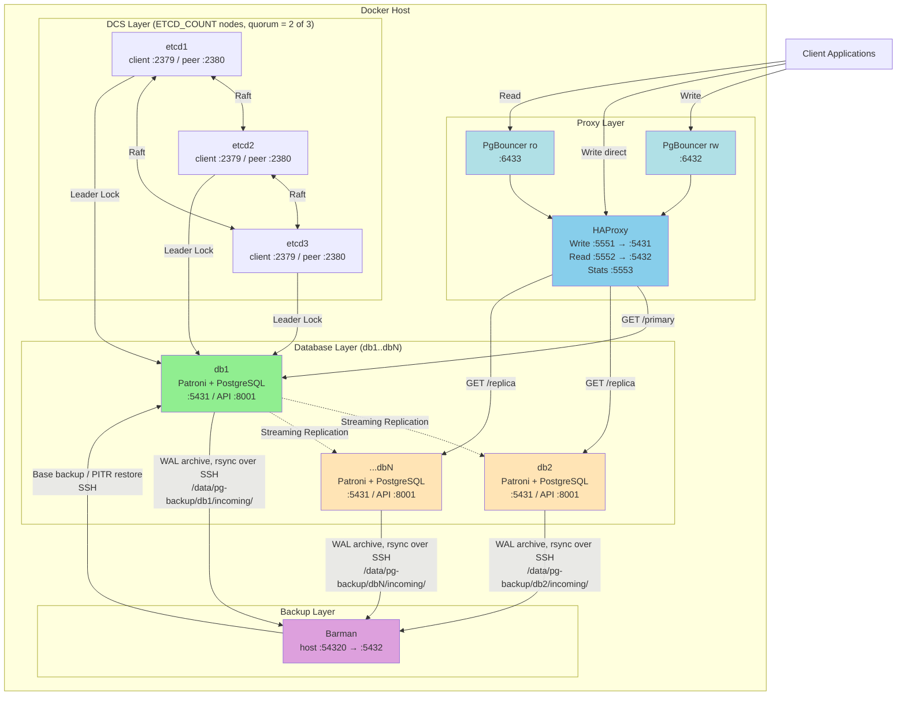
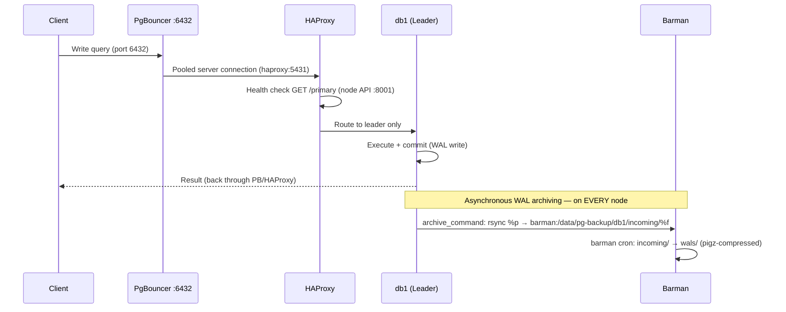
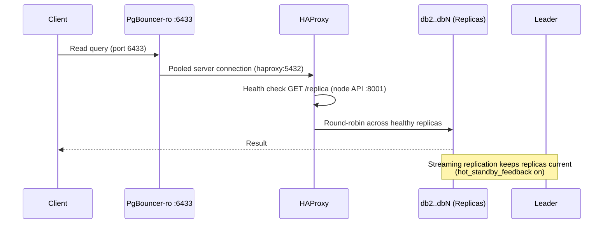
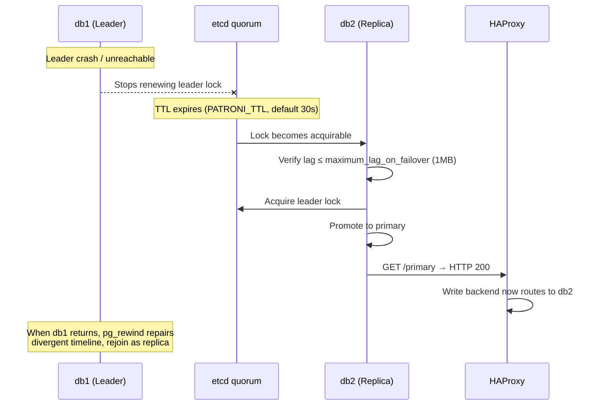
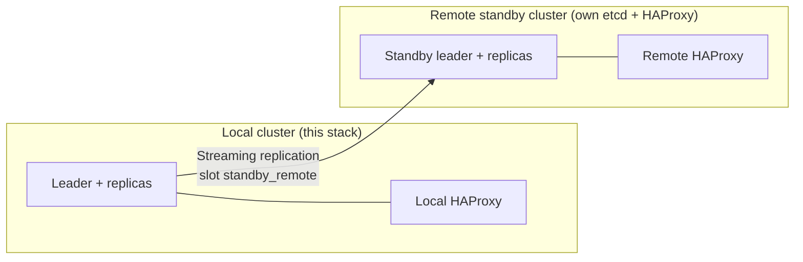

# Architecture Deep Dive

Complete architectural documentation for the Patroni HA + Barman stack.

Everything in this stack is **configured from a single `.env` file**. The number of
database nodes, the etcd cluster size, ports, credentials, PostgreSQL tuning, backup
retention — all of it is declared in `.env` (see `.env.example`) and rendered into
runtime configuration by the generation pipeline described below. There are no
hand-edited per-node config files.

Default example used throughout this document: **3 replicas + 1 leader** (`db1`–`db4`,
`PATRONI_REPLICAS=3`), **3 etcd nodes** (`ETCD_COUNT=3`, quorum 2), PostgreSQL 15
(`POSTGRES_VERSION`), cluster name `patroni1` (`PATRONI_CLUSTER_NAME`), pinned subnet
`172.20.0.0/16` (`NETWORK_SUBNET`).

---

## Component Topology


```mermaid
graph TB
    subgraph "Docker Host"
        subgraph "DCS Layer (ETCD_COUNT nodes, quorum = 2 of 3)"
            E1[etcd1<br/>client :2379 / peer :2380]
            E2[etcd2<br/>client :2379 / peer :2380]
            E3[etcd3<br/>client :2379 / peer :2380]
            E1 <-->|Raft| E2
            E2 <-->|Raft| E3
            E1 <-->|Raft| E3
        end

        subgraph "Database Layer (db1..dbN)"
            D1[db1<br/>Patroni + PostgreSQL<br/>:5431 / API :8001]
            D2[db2<br/>Patroni + PostgreSQL<br/>:5431 / API :8001]
            DN[...dbN<br/>Patroni + PostgreSQL<br/>:5431 / API :8001]

            D1 -.->|Streaming Replication| D2
            D1 -.->|Streaming Replication| DN
        end

        subgraph "Proxy Layer"
            PGB1[PgBouncer rw<br/>:6432]
            PGB2[PgBouncer ro<br/>:6433]
            HAP[HAProxy<br/>Write :5551 → :5431<br/>Read :5552 → :5432<br/>Stats :5553]
            PGB1 --> HAP
            PGB2 --> HAP
        end

        subgraph "Backup Layer"
            BAR[Barman<br/>host :54320 → :5432]
        end

        E1 -->|Leader Lock| D1
        E2 -->|Leader Lock| D1
        E3 -->|Leader Lock| D1
        HAP -->|GET /primary| D1
        HAP -->|GET /replica| D2
        HAP -->|GET /replica| DN
        D1 -->|WAL archive, rsync over SSH<br/>/data/pg-backup/db1/incoming/| BAR
        D2 -->|WAL archive, rsync over SSH<br/>/data/pg-backup/db2/incoming/| BAR
        DN -->|WAL archive, rsync over SSH<br/>/data/pg-backup/dbN/incoming/| BAR
        BAR -->|Base backup / PITR restore<br/>SSH| D1
    end

    CLIENT[Client Applications] -->|Write| PGB1
    CLIENT -->|Write direct| HAP
    CLIENT -->|Read| PGB2

    style D1 fill:#90EE90
    style D2 fill:#FFE4B5
    style DN fill:#FFE4B5
    style HAP fill:#87CEEB
    style PGB1 fill:#B0E0E6
    style PGB2 fill:#B0E0E6
    style BAR fill:#DDA0DD
```

**Legend**:
- 🟢 Green: Leader (elected by Patroni from all members — any `dbN` can be leader)
- 🟡 Yellow: Replica nodes
- 🔵 Blue: Load balancer and connection poolers
- 🟣 Purple: Backup server

---

## Configuration Pipeline

The stack uses a two-stage configuration model: **build-time generation** for
infrastructure components and **container-start rendering** for Patroni itself.

### Stage 1 — Build-time generation (`make generate`)

`scripts/generate_configs.sh` reads `.env`, expands `templates/*.tpl`, and writes:

- `configs/haproxy.cfg` — HAProxy backends, one `server dbN` line per node
- `configs/barman.conf` — global Barman settings plus one `[dbN]` section per node
  with `archiver = on`
- `configs/pgbouncer.ini` / `configs/pgbouncer-ro.ini` — pooler configs
- `barman/supervisord.conf` — Barman's internal process supervisor
- `docker-compose.yml` — the full service topology for the current node counts
- `.env.example` — refreshed port entries for the current topology

All of these are **gitignored build artifacts**. Never edit them by hand; change `.env`
and re-run `make generate` (or `make up`, which regenerates automatically).

### Stage 2 — Container-start rendering (Patroni)

There are **no per-node `configs/patroniN.yml` files**. Instead:

1. `templates/patroni.yml.tpl` is mounted **read-only** into every `dbN` container at
   `/etc/patroni/patroni.yml.tpl`.
2. On startup, `patroni/entrypoint.sh` renders it to `/etc/patroni/patroni.yml`,
   substituting the node's own hostname plus passwords and `PG_*` tuning from
   container environment variables.
3. Patroni (managed by supervisord) then runs with that per-node config.

This is what makes the cluster elastically sized: every node runs the same template
and self-configures at boot, so adding `db5` requires zero new config files.

### Two ways to set up

- `make wizard` — linear 6-step guided setup (cluster identity → database nodes →
  administrator → default database → ports → review & confirm). Nothing is written
  until the review is confirmed.
- `make up` — non-interactive: generates configs from the existing `.env` and starts
  everything. `make generate` regenerates configs without starting containers.
- `make smoke-test` — sandboxed docker-stub tests of the wizard and PITR flows
  (`scripts/testing/smoke_test_wizard.sh`, `scripts/testing/smoke_test_pitr.sh`);
  no Docker or running stack needed.

---

## Data Flow Diagrams

### Write Path (via PgBouncer or direct HAProxy)


```mermaid
sequenceDiagram
    participant Client
    participant PB as PgBouncer :6432
    participant HAProxy
    participant Leader as db1 (Leader)
    participant BAR as Barman

    Client->>PB: Write query (port 6432)
    PB->>HAProxy: Pooled server connection (haproxy:5431)
    HAProxy->>HAProxy: Health check GET /primary (node API :8001)
    HAProxy->>Leader: Route to leader only
    Leader->>Leader: Execute + commit (WAL write)
    Leader-->>Client: Result (back through PB/HAProxy)

    Note over Leader,BAR: Asynchronous WAL archiving — on EVERY node
    Leader->>BAR: archive_command: rsync %p → barman:/data/pg-backup/db1/incoming/%f
    BAR->>BAR: barman cron: incoming/ → wals/ (pigz-compressed)
```

### Read Path (Replicas)


```mermaid
sequenceDiagram
    participant Client
    participant PB as PgBouncer-ro :6433
    participant HAProxy
    participant Replica as db2..dbN (Replicas)
    participant Leader as Leader

    Client->>PB: Read query (port 6433)
    PB->>HAProxy: Pooled server connection (haproxy:5432)
    HAProxy->>HAProxy: Health check GET /replica (node API :8001)
    HAProxy->>Replica: Round-robin across healthy replicas
    Replica-->>Client: Result
    Note over Replica,Leader: Streaming replication keeps replicas current<br/>(hot_standby_feedback on)
```

### Failover Sequence


```mermaid
sequenceDiagram
    participant Leader as db1 (Leader)
    participant E as etcd quorum
    participant Replica as db2 (Replica)
    participant HAProxy

    Note over Leader: Leader crash / unreachable
    Leader--xE: Stops renewing leader lock
    Note over E: TTL expires (PATRONI_TTL, default 30s)
    E->>Replica: Lock becomes acquirable
    Replica->>Replica: Verify lag ≤ maximum_lag_on_failover (1MB)
    Replica->>E: Acquire leader lock
    Replica->>Replica: Promote to primary
    Replica->>HAProxy: GET /primary → HTTP 200
    HAProxy->>HAProxy: Write backend now routes to db2
    Note over Leader: When db1 returns, pg_rewind repairs<br/>divergent timeline, rejoin as replica
```

---

## Ports

### Host → Container mappings

| Service | Host port (default) | Container port | Purpose | Config |
|---------|--------------------|----------------|---------|--------|
| etcd1 | 2379 | 2379 | etcd client API | `ETCD1_CLIENT_PORT` |
| etcd1 | 2380 | 2380 | etcd peer (Raft) | `ETCD1_PEER_PORT` |
| etcd2 | 22379 | 2379 | etcd client API | `ETCD2_CLIENT_PORT` |
| etcd2 | 22380 | 2380 | etcd peer (Raft) | `ETCD2_PEER_PORT` |
| etcd3 | 32379 | 2379 | etcd client API | `ETCD3_CLIENT_PORT` |
| etcd3 | 32380 | 2380 | etcd peer (Raft) | `ETCD3_PEER_PORT` |
| db1..dbN | 15431, 15432, ... | 5431 | PostgreSQL direct node access | `PATRONI_BASE_PORT` / `PATRONI_DBn_PORT` |
| db1..dbN | 8001, 8002, ... | 8001 | Patroni REST API | `PATRONI_API_BASE_PORT` / `PATRONI_DBn_API_PORT` |
| haproxy | 5551 | 5431 | **Write endpoint** (leader only) | `HAPROXY_WRITE_PORT` |
| haproxy | 5552 | 5432 | **Read endpoint** (replicas) | `HAPROXY_READ_PORT` |
| haproxy | 5553 | 8404 | Stats page (basic auth) | `HAPROXY_STATS_PORT` |
| pgbouncer | 6432 | 6432 | Read-write pool (transaction mode) | `PGBOUNCER_PORT` |
| pgbouncer-ro | 6433 | 6432 | Read-only pool | `PGBOUNCER_RO_PORT` |
| barman | 54320 | 5432 | Barman (PostgreSQL protocol) | `BARMAN_PORT` |
| pgbadger | 8080 | 80 | pgBadger report web UI | `PGBADGER_PORT` |

### Container-internal ports (inside the Docker network)

| Service | Port | Purpose |
|---------|------|---------|
| etcd1..etcdN | 2379 / 2380 | Client API / peer Raft traffic (same on all etcd nodes) |
| db1..dbN | 5431 | PostgreSQL — **same port on every node** |
| db1..dbN | 8001 | Patroni REST API — **same port on every node** |
| db1..dbN | 22 | SSH (sshd under supervisord; used for WAL archiving and backups) |
| haproxy | 5431 / 5432 / 8404 | Write / read / stats listeners |
| pgbouncer, pgbouncer-ro | 6432 | Pool listeners |
| barman | 22 / 5432 | SSH (receives WAL) / PostgreSQL protocol |

Because all database containers use identical internal ports, only the **host** ports
differ (assigned sequentially from `PATRONI_BASE_PORT` and `PATRONI_API_BASE_PORT`).
In-network services (HAProxy, PgBouncer, Barman) always target `dbN:5431` and
`dbN:8001` regardless of cluster size.

---

## Volumes

| Volume | Mount point | Purpose | Size estimate |
|--------|-------------|---------|---------------|
| `etcd{n}_data` | `/etcd-data` | etcd cluster state per node | ~100MB each |
| `db{n}_data` | `/var/lib/postgresql` | PostgreSQL data + config per node | DB size + WAL |
| `barman_data` | `/var/lib/barman` | Barman metadata, logs | ~1GB |
| `barman_backup` | `/data/pg-backup` | WALs + base backups for **all** nodes | 2–3× DB size |

### PostgreSQL data directory (per node)

```
/var/lib/postgresql/<PG_VERSION>/<CLUSTER_NAME>/     ← e.g. /var/lib/postgresql/15/patroni1
├── base/              # Data files
├── pg_wal/            # Local WAL (before archiving)
└── postgresql.conf    # Managed by Patroni
```

The directory name is the **cluster scope**, not the node name — every node uses the
same path (`/var/lib/postgresql/15/patroni1`), distinguished only by living in its own
`db{n}_data` volume. Changing `POSTGRES_VERSION` or `PATRONI_CLUSTER_NAME` therefore
changes the data path: plan a rebuild before touching them.

### Barman backup structure (shared for all nodes)

```
/data/pg-backup/
└── db<N>/                     # One directory per node (by hostname)
    ├── incoming/              # WAL staging (rsync target of archive_command)
    ├── wals/<timeline>/       # Processed, pigz-compressed WALs
    └── base/<backup-id>/      # Base backups
```

---

## Network Architecture

- **Network**: `patroni_network`, bridge driver
- **Subnet**: pinned via `NETWORK_SUBNET` (default `172.20.0.0/16`) — deterministic
  addresses, not Docker auto-assignment
- **DNS**: Docker's embedded DNS resolves service names (`db1`, `etcd2`, `barman`, ...)

### Service communication matrix

| From | To | Method | Purpose |
|------|-----|--------|---------|
| db1..dbN | etcd1..etcdN | HTTP (etcd3 API, port 2379) | Patroni DCS: leader lock, topology |
| etcd nodes | each other | HTTP (port 2380) | Raft consensus |
| db1..dbN | each other | PostgreSQL streaming (5431) | Replication |
| db1..dbN | barman | rsync over SSH (22) | WAL archiving (every node) |
| barman | db1..dbN | SSH + psql (5431) | Base backups, WAL fetch, restore |
| haproxy | db1..dbN | HTTP GET (8001) | Health checks: `/primary`, `/replica` |
| pgbouncer | haproxy | PostgreSQL (5431/5432) | Pooled routing |
| Clients | pgbouncer / haproxy | PostgreSQL (6432/6433/5551/5552) | Application traffic |

**Security note**: all traffic is plaintext (no TLS) and containers share one network.
Passwords use SCRAM-SHA-256, but this stack is a learning/lab environment — see
[Design Decisions](#design-decisions--tradeoffs).

---

## Component Responsibilities

### Patroni + PostgreSQL nodes (db1..dbN)

- Run PostgreSQL (`POSTGRES_VERSION`, default 15) under Patroni's control
- Elect exactly one leader via an exclusive lock in etcd
- Stream replication to replicas (replication slots enabled: `use_slots: true`)
- Archive WAL to Barman from **every node** (see below)
- Expose the REST API on 8001 for HAProxy health checks and `patronictl`

Key DCS settings (from `templates/patroni.yml.tpl`, overridable via `.env`):

```yaml
ttl: 30                      # PATRONI_TTL — leader lock TTL (seconds)
loop_wait: 10                # PATRONI_LOOP_WAIT — health loop interval
retry_timeout: 10            # PATRONI_RETRY_TIMEOUT
maximum_lag_on_failover: 1048576   # 1MB — promotion lag threshold
master_start_timeout: 300
synchronous_mode: false      # Async replication (RPO may lose in-flight txns)
postgresql:
  use_pg_rewind: true        # Automatic timeline repair on old leader rejoin
  use_slots: true
```

PostgreSQL tuning defaults (all overridable via `.env` §4):

| Parameter | Default |
|-----------|---------|
| `max_connections` | 200 |
| `shared_buffers` | 2GB |
| `effective_cache_size` | 6GB |
| `work_mem` | 16MB |
| `maintenance_work_mem` | 512MB |

### etcd (Distributed Configuration Store)

- Stores the leader lock, cluster topology, and Patroni's dynamic configuration
- `ETCD_COUNT` nodes (default 3); odd counts required for sane quorum math
- With 3 nodes: **quorum = 2, tolerates 1 node failure**; losing 2 halts elections and
  puts the cluster read-only until a member returns
- Membership lives in the `etcd{n}_data` volumes: changing `ETCD_COUNT` on an existing
  deployment requires `make destroy` + fresh bootstrap

### HAProxy

- Splits read/write traffic using Patroni's REST API as the health signal:
  - **Write backend**: `GET /primary` → HTTP 200 only on the leader (`balance first`,
    `on-marked-down shutdown-sessions` so clients fail fast during failover)
  - **Read backend**: `GET /replica` → HTTP 200 only on healthy replicas
    (`balance roundrobin`)
- Checks run every 2s (3 failures to mark down, 2 successes to mark up)
- Stats page on host port 5553, protected by `HAPROXY_STATS_USER` /
  `HAPROXY_STATS_PASSWORD` basic auth

Health check config (generated into `configs/haproxy.cfg`):

```haproxy
backend patroni_write_backend
    balance first
    option httpchk GET /primary
    http-check expect status 200

backend patroni_read_backend
    balance roundrobin
    option httpchk GET /replica
    http-check expect status 200
```

### PgBouncer (×2)

Two separate pooler containers front HAProxy:

| Instance | Host port | Upstream | Mode |
|----------|-----------|----------|------|
| `pgbouncer` | 6432 | `haproxy:5431` (write) | transaction pooling |
| `pgbouncer-ro` | 6433 | `haproxy:5432` (read) | transaction pooling |

Defaults: `default_pool_size=50`, `max_client_conn=1000`, `reserve_pool_size=10`
(`.env` §5). Layering PgBouncer **in front of** HAProxy means pooling survives
failovers — pooled server connections are re-established against whichever node
HAProxy reports healthy.

### Barman

- Receives WAL from **every node** — each node's `archive_command` resolves its own
  hostname at runtime and rsyncs each segment over SSH to its own directory on the
  barman container: `barman:/data/pg-backup/$HOSTNAME/incoming/`. There is no
  leader-only check, so a newly promoted leader is already archiving with zero
  post-failover reconfiguration
- `barman.conf` contains one `[dbN]` section per node with `archiver = on`
- `barman cron` (supervisord) moves WALs from `incoming/` to `wals/`, pigz-compressed
- Base backups via rsync over SSH (`make backup` auto-detects the leader)
- Retention: `RECOVERY WINDOW OF 7 DAYS` (`BARMAN_RETENTION_POLICY`), bandwidth limit
  50000 KBps, 4 parallel jobs
- PITR: `make pitr` (see [docs/pitr.md](docs/pitr.md)); `restore_command` pulls from
  the node's own directory and transparently decompresses

---

## Failure Modes & Recovery

### Database node failure

**Scenario**: the leader crashes.

1. Leader lock expires after `PATRONI_TTL` (30s default)
2. Eligible replicas check lag against `maximum_lag_on_failover` (1MB)
3. The replica that wins the lock promotes
4. HAProxy's `/primary` check flips the write backend to the new leader
   (in-flight connections are dropped via `shutdown-sessions`)

**Time to recovery**: ~30–45s. **Data loss risk**: up to
`maximum_lag_on_failover` of unreplicated WAL (async mode); enable
`synchronous_mode` for zero loss at the cost of write latency. When the old leader
returns, `use_pg_rewind: true` rewinds its divergent timeline so it rejoins as a
replica automatically.

### etcd failures

| Failure | Impact | Recovery |
|---------|--------|----------|
| 1 of 3 etcd down | None — quorum (2) maintained | `docker-compose up -d etcdN`; data persists in its volume |
| 2 of 3 etcd down | No elections; leader steps down when its lock lapses; cluster read-only | Restart at least one more member; Patroni reconnects automatically |
| Odd/even mismatch | Even `ETCD_COUNT` wastes a node's fault tolerance | Change requires `make destroy` + fresh bootstrap |

### Split-brain prevention

etcd is the single source of truth and the leader lock is exclusive. A leader
partitioned away from the etcd quorum cannot renew its lock and demotes itself, so
two primaries cannot coexist. If the old primary's WAL diverged before demotion,
`pg_rewind` repairs it on rejoin.

### Barman failure

WAL archiving fails and WAL accumulates in each node's `pg_wal/` (bounded by
`max_wal_size`, 8GB default — monitor disk). Backups and PITR are unavailable until
Barman returns; replication and failover are **unaffected**. Detection: `make check`,
`make check-archive`, or `docker exec barman barman check dbN`.

### PgBouncer / HAProxy failure

A pooler crash cuts its host port only (6432 or 6433); the other pooler and the direct
HAProxy ports keep working. An HAProxy crash cuts all external traffic
(container-to-container paths still work); `restart: unless-stopped` recovers it.

---

## Scaling

### Adding/removing database nodes

1. Edit `PATRONI_REPLICAS` in `.env`
2. Run `make generate && make up` (or just re-run `make wizard`)

The generator rebuilds `docker-compose.yml` with the new `dbN` services, HAProxy
backends, and Barman `[dbN]` sections. New nodes join as replicas via `pg_basebackup`
(rate-limited by `PATRONI_BASEBACKUP_MAX_RATE`, default 100MB/s). Removing nodes
orphans their volumes — clean up with `make disk` or `docker volume rm`.

**Do not** hand-edit `docker-compose.yml` (it is regenerated and gitignored).

### What requires a full rebuild

Changing these on an existing cluster requires `make destroy` + fresh bootstrap:

- `ETCD_COUNT` (etcd membership is baked into volumes)
- `PATRONI_CLUSTER_NAME` (changes the DCS namespace **and** the PG data dir path)
- `POSTGRES_VERSION` (changes `data_dir`/`bin_dir` paths — use `pg_upgrade` flows
  instead for real upgrades)

---

## Cross-Cluster Disaster Recovery (optional)

The stack ships runbooks for a **remote standby cluster** — a separate, independently
deployed Patroni cluster (its own etcd, its own HAProxy) that replicates from the
local cluster and can be promoted in a controlled switchover:


```mermaid
graph LR
    subgraph "Local cluster (this stack)"
        L[Leader + replicas] --- LH[Local HAProxy]
    end
    subgraph "Remote standby cluster (own etcd + HAProxy)"
        R[Standby leader + replicas] --- RH[Remote HAProxy]
    end
    L -->|Streaming replication<br/>slot standby_remote| R
```

- **Forward** (`local → remote`): `make switchover-to-remote`
- **Reverse** (`remote → local`): `make switchover-from-remote`
- Safety flags: `YES=1` (skip prompts), `DRY_RUN=1` (rehearse without changes),
  `SKIP_BACKUP=1` (skip the pre-switchover base backup)

The implementation (`scripts/ops/lib/cross_cluster.sh` plus the wrapper scripts)
performs identity/version preflight checks, waits for replication lag to drain to
zero, blocks writes at the catalog level, flips the remote cluster's
`standby_cluster` DCS configuration, and reverses the replication direction with
dedicated slots (`standby_remote` / `mac_standby`).

Remote endpoints are declared in `.env` §8 (`REMOTE_SSH_HOST`, `REMOTE_HAPROXY_HOST`,
ports, etc.; the example values use documentation IPs like `192.0.2.10`). Full
procedure: [docs/switchover.md](docs/switchover.md) and
[docs/remote_standby.md](docs/remote_standby.md).

---

## Monitoring Integration Points

| Source | How | Notes |
|--------|-----|-------|
| Patroni REST API (per node, 8001+) | `GET /primary`, `GET /replica`, `GET /patroni` | `/patroni` returns JSON: role, state, timeline, lag |
| HAProxy stats | `http://localhost:5553/stats` | Basic auth (`HAPROXY_STATS_USER`/`_PASSWORD`) |
| Barman | `make list-backups`, `docker exec barman barman status dbN` | WAL archiver health, backup inventory |
| PostgreSQL | `make slow-queries`, `make stats`, `make activity`, `make pgbadger NODE=dbN` | `pg_stat_statements` preloaded |

```bash
curl -s http://localhost:8001/patroni | python3 -m json.tool | grep role
```

---

## Operational Boundaries

### What this stack provides

- ✅ Automated HA: leader election, failover, switchover (`make switchover`), reinit
- ✅ Read scaling: round-robin replicas behind HAProxy + PgBouncer
- ✅ Connection pooling: two PgBouncer instances (rw / ro)
- ✅ Continuous WAL archiving from every node + base backups + PITR (`make pitr`)
- ✅ Cross-cluster DR runbooks (`make switchover-to-remote` / `-from-remote`)
- ✅ Operations tooling: health checks, smoke tests, disk cleanup, pgBadger, logical
  dump/restore

### What it does not provide

- ❌ TLS anywhere (PostgreSQL, etcd, SSH are plaintext) — lab-grade security posture
- ❌ Monitoring dashboards/alerting (Prometheus/Grafana not included; the REST APIs
  and stats endpoints above are the integration points)
- ❌ Automated scheduled backups (backups are operator-triggered via `make backup`)
- ❌ Kubernetes-style multi-host scheduling — everything runs on one Docker host
  (the remote-standby runbooks are the supported path to geographic redundancy)

---

## Design Decisions & Tradeoffs

### Why etcd as DCS?

Purpose-built for leader election with strong consistency (Raft). An odd-sized cluster
(default 3) tolerates 1 failure with quorum 2. Tradeoff: the DCS is a separate
failure domain whose volume state makes topology changes a rebuild operation.

### Why both HAProxy **and** PgBouncer?

They solve different problems: HAProxy's Patroni-aware health checks give write/read
routing and failover transparency; PgBouncer gives connection pooling. Ordering them
PgBouncer → HAProxy keeps pools ignorant of topology changes. Tradeoff: two proxy
hops; latency-sensitive clients may connect to HAProxy directly (5551/5552).

### Why does every node archive WAL?

Only the leader's WAL "counts" for recovery, but replicas receive the same stream, so
a freshly promoted leader is already archiving — no post-failover reconfiguration and
no archive gap during the promotion window. Tradeoff: roughly N× WAL storage on the
Barman volume; retention keeps it bounded.

### Why Barman (not ad-hoc `pg_basebackup` scripts)?

WAL compression and retention policies, per-node server definitions, `get-wal`
recovery support, battle-tested PITR tooling. Tradeoff: an extra stateful service
with its own SSH trust web.

### Why is the Patroni config rendered at container start?

One template + node self-identification = a cluster that scales to any
`PATRONI_REPLICAS` with zero per-node files on the host. Tradeoff: the running config
lives only inside the container; inspect it with
`docker exec dbN cat /etc/patroni/patroni.yml`.

### Why a pinned Docker subnet?

`NETWORK_SUBNET` (default `172.20.0.0/16`) makes container addressing deterministic —
useful for firewall rules, hosts-file aliases, and the cross-cluster replication
paths in `.env` §8. Tradeoff: collides if the range is already in use.

### Why Docker Compose (not Kubernetes)?

Lowest barrier to running a realistic HA stack: real etcd quorum, real failovers,
real WAL archiving, one command to destroy and rebuild. The operational patterns
(health-check-driven routing, DCS quorum, WAL retention) translate directly to
Kubernetes operators, but this project intentionally stays single-host.

---

## References

- Upstream: [Patroni](https://patroni.readthedocs.io/) ·
  [Barman](https://www.pgbarman.org/documentation/) ·
  [PostgreSQL replication](https://www.postgresql.org/docs/15/warm-standby.html) ·
  [etcd](https://etcd.io/docs/) · [HAProxy](https://docs.haproxy.org/) ·
  [PgBouncer](https://www.pgbouncer.org/)
- In this repo: [docs/pitr.md](docs/pitr.md) (point-in-time recovery) ·
  [docs/switchover.md](docs/switchover.md) (cross-cluster switchover) ·
  [docs/remote_standby.md](docs/remote_standby.md) (standby setup) ·
  [docs/runbooks.md](docs/runbooks.md) · [docs/checks.md](docs/checks.md)
