# Architecture Deep Dive

Complete architectural documentation for the Patroni HA + Barman stack.

## Component Topology


**Legend**:
- 🟢 Green: Leader node
- 🟡 Yellow: Replica nodes
- 🔵 Blue: Load balancer
- 🟣 Purple: Backup server

---

## Data Flow Diagrams

### Write Path (Leader)


### Read Path (Replicas)


### Failover Sequence

```mermaid
sequenceDiagram
    participant Leader as db1 (Leader)
    participant etcd
    participant Replica as db2 (Replica)
    participant HAProxy
    
    Note over Leader: Leader Crash/Unavailable
    Leader-xetcd: Lock Expires (TTL: 30s)
    etcd->>Replica: Lock Available
    Replica->>Replica: Check Replication Lag
    Replica->>etcd: Acquire Leader Lock
    Replica->>Replica: Promote to Leader
    Replica->>Replica: Start Accepting Writes
    Replica->>HAProxy: Health Check /master → 200
    HAProxy->>HAProxy: Update Backend
    Note over HAProxy: Write Traffic Routes to New Leader
```



---

## Ports Table

### External Ports (Host → Container)

| Service | Port | Protocol | Purpose | Config Key |
|---------|------|----------|---------|------------|
| etcd1 | 2379 | TCP | etcd client API | `ETCD1_CLIENT_PORT` |
| etcd1 | 12380 | TCP | etcd peer communication | `ETCD1_PEER_PORT` |
| etcd2 | 22379 | TCP | etcd client API | `ETCD2_CLIENT_PORT` |
| etcd2 | 22380 | TCP | etcd peer communication | `ETCD2_PEER_PORT` |
| db1 | 15431 | TCP | PostgreSQL | `PATRONI_DB1_PORT` |
| db1 | 8001 | TCP | Patroni REST API | `PATRONI_DB1_API_PORT` |
| db2 | 15432 | TCP | PostgreSQL | `PATRONI_DB2_PORT` |
| db2 | 8002 | TCP | Patroni REST API | `PATRONI_DB2_API_PORT` |
| db3 | 15433 | TCP | PostgreSQL | `PATRONI_DB3_PORT` |
| db3 | 8003 | TCP | Patroni REST API | `PATRONI_DB3_API_PORT` |
| db4 | 15434 | TCP | PostgreSQL | `PATRONI_DB4_PORT` |
| db4 | 8004 | TCP | Patroni REST API | `PATRONI_DB4_API_PORT` |
| haproxy | 5551 | TCP | Write endpoint (leader) | `HAPROXY_WRITE_PORT` |
| haproxy | 5552 | TCP | Read endpoint (replicas) | `HAPROXY_READ_PORT` |
| haproxy | 5553 | HTTP | Stats page | `HAPROXY_STATS_PORT` |
| barman | 5432 | TCP | PostgreSQL protocol | `BARMAN_PORT` |

### Internal Ports (Container Network)

| Service | Port | Protocol | Purpose |
|---------|------|----------|---------|
| etcd1/etcd2 | 2379 | TCP | etcd client API |
| etcd1/etcd2 | 2380 | TCP | etcd peer communication |
| db1-db4 | 5431 | TCP | PostgreSQL (internal) |
| db1-db4 | 8001 | TCP | Patroni REST API (internal) |
| db1-db4 | 22 | TCP | SSH (for WAL archiving) |
| haproxy | 5431 | TCP | Write backend |
| haproxy | 5432 | TCP | Read backend |
| haproxy | 8404 | HTTP | Stats interface |
| barman | 5432 | TCP | PostgreSQL protocol |

**Note**: All Patroni nodes use port `8001` internally for REST API, but external ports differ (`8001-8004`) to avoid conflicts.

---

## Volumes Table

| Volume Name | Mount Point | Purpose | Size Estimate |
|-------------|-------------|---------|---------------|
| `etcd1_data` | `/etcd-data` | etcd1 cluster data | ~100MB |
| `etcd2_data` | `/etcd-data` | etcd2 cluster data | ~100MB |
| `db1_data` | `/var/lib/postgresql` | PostgreSQL data (db1) | Database size + WAL |
| `db2_data` | `/var/lib/postgresql` | PostgreSQL data (db2) | Database size + WAL |
| `db3_data` | `/var/lib/postgresql` | PostgreSQL data (db3) | Database size + WAL |
| `db4_data` | `/var/lib/postgresql` | PostgreSQL data (db4) | Database size + WAL |
| `barman_data` | `/var/lib/barman` | Barman metadata, logs | ~1GB |
| `barman_backup` | `/data/pg-backup` | WALs + base backups | 2-3x database size |

**Data Directory Structure** (per PostgreSQL node):
```
/var/lib/postgresql/15/patroni{N}/
├── base/              # PostgreSQL data files
├── pg_wal/            # WAL files (local)
├── pg_tblspc/         # Tablespaces
└── postgresql.conf    # Configuration
```

**Barman Backup Structure**:
```
/data/pg-backup/{server}/
├── incoming/          # WAL staging (temporary)
├── wals/              # Processed WALs by timeline
│   └── {timeline}/
│       ├── 000000010000000000000001
│       └── 000000010000000000000002.gz
├── base/              # Base backups
│   └── {backup-id}/
│       └── data/
└── .barman/           # Metadata
```

---

## Network Architecture

### Network: `patroni_network`

- **Type**: Bridge network
- **Driver**: `bridge` (default)
- **Subnet**: Auto-assigned (typically `172.20.0.0/16`)
- **DNS**: Container hostnames resolve automatically

### Service Communication

| From | To | Method | Purpose |
|------|-----|--------|---------|
| db1-db4 | etcd1/etcd2 | HTTP | Patroni DCS communication |
| db1-db4 | db1-db4 | PostgreSQL streaming | Replication |
| db1-db4 | barman | SSH/rsync | WAL archiving |
| barman | db1-db4 | SSH | Backup operations |
| haproxy | db1-db4 | HTTP | Health checks (Patroni API) |
| haproxy | db1-db4 | PostgreSQL | Query routing |
| Clients | haproxy | PostgreSQL | Application connections |

**Security Note**: All communication is unencrypted (no TLS). Suitable for playground, not production.

---

## Component Responsibilities

### PostgreSQL Nodes (db1-db4)

**Responsibilities**:
- Run PostgreSQL 15 database server
- Participate in Patroni cluster
- Stream WAL to Barman (leader only)
- Accept streaming replication (replicas)
- Provide Patroni REST API for health checks

**Failure Domain**: Single node
- Node failure → Automatic failover (if replica available)
- Data corruption → Requires restore from backup

**Dependencies**:
- etcd (for cluster coordination)
- Barman (for WAL archiving, leader only)
- Network connectivity to other nodes

---

### Patroni

**Responsibilities**:
- Leader election coordination
- Replication slot management
- Automatic failover
- Health monitoring
- Configuration management

**Failure Domain**: Per-node
- Patroni crash → PostgreSQL continues, but no cluster coordination
- etcd unreachable → Patroni cannot coordinate, cluster may split

**Key Settings** (from `configs/patroni1.yml`):
```yaml
scope: patroni1
name: db1
namespace: /patroni1
retry_timeout: 10
bootstrap:
  dcs:
    ttl: 30                    # Leader lock TTL
    loop_wait: 10              # Health check interval
    maximum_lag_on_failover: 1048576  # 1MB lag threshold
    postgresql:
      use_pg_rewind: true      # Enable timeline repair
      use_slots: true          # Use replication slots
```

---

### etcd (Distributed Configuration Store)

**Responsibilities**:
- Store leader lock
- Maintain member list
- Coordinate elections
- Store cluster topology

**Failure Domain**: Cluster-wide
- Single etcd failure → Cluster continues (quorum maintained with 2 nodes)
- Both etcd failures → Cluster loses coordination (manual intervention required)

**Quorum**: 2 nodes → 1 node can fail, cluster continues

**Key Settings** (from `docker-compose.yml`):
```yaml
--initial-cluster=etcd1=http://etcd1:2380,etcd2=http://etcd2:2380
--initial-cluster-state=new
```

---

### HAProxy

**Responsibilities**:
- Route write queries to leader
- Distribute read queries to replicas
- Health checking
- Connection pooling

**Failure Domain**: Single point of failure
- HAProxy failure → All external access lost (internal connections still work)

**Health Check Logic**:
- Write backend: `GET /master` → Returns 200 only if node is leader
- Read backend: `GET /replica` → Returns 200 only if node is replica

**Configuration** (from `configs/haproxy.cfg`):
```haproxy
backend patroni_write_backend
    balance first
    option httpchk GET /master
    http-check expect status 200

backend patroni_read_backend
    balance roundrobin
    option httpchk GET /replica
    http-check expect status 200
```

---

### Barman

**Responsibilities**:
- Receive WAL files via SSH/rsync
- Process and compress WAL files
- Store base backups
- Provide recovery tools

**Failure Domain**: Single point of failure
- Barman failure → WAL archiving stops, backups unavailable

**WAL Processing Flow**:
1. WAL arrives in `/data/pg-backup/{server}/incoming/`
2. Barman cron (every minute) processes WAL
3. WAL moved to `/data/pg-backup/{server}/wals/{timeline}/`
4. WAL compressed (`.gz`) after processing
5. Old WALs purged per retention policy

**Configuration** (from `configs/barman.conf`):
```ini
[barman]
retention_policy = RECOVERY WINDOW OF 1 DAYS
wal_retention_policy = main
minimum_redundancy = 1
```

---

## Failure Modes & Recovery

### Single Node Failure

**Scenario**: db1 (leader) crashes

**Automatic Recovery**:
1. etcd leader lock expires (30 seconds)
2. Patroni on db2/db3/db4 detects lock available
3. Replica with lowest lag promotes
4. HAProxy detects new leader via health check
5. Write traffic routes to new leader

**Manual Intervention**: None required (automatic)

**Time to Recovery**: ~30-40 seconds (TTL + promotion time)

---

### etcd Quorum Loss

**Scenario**: Both etcd1 and etcd2 fail

**Impact**:
- Patroni cannot coordinate
- Current leader continues until lock expires
- No new elections possible
- Replicas continue streaming (if leader still up)

**Recovery**:
```bash
# Restart etcd nodes
docker-compose restart etcd1 etcd2

# Wait for etcd to recover
docker exec etcd1 etcdctl endpoint health

# Patroni will automatically reconnect
```

**Prevention**: Use 3+ etcd nodes in production for true quorum.

---

### Split-Brain Prevention

**How it's prevented**:
- etcd provides single source of truth
- Leader lock is exclusive (only one node can hold it)
- Patroni checks etcd before promoting

**Scenario**: Network partition between leader and etcd

**Behavior**:
- Leader continues serving (lock not released)
- Replicas cannot promote (cannot acquire lock)
- After TTL expires, if leader still partitioned, replicas may promote
- When partition heals, pg_rewind repairs timeline divergence

**Mitigation**: `use_pg_rewind: true` enables automatic timeline repair.

---

### WAL Archiving Failure

**Scenario**: Barman unreachable or SSH key missing

**Impact**:
- WALs accumulate in `pg_wal/` directory
- May fill disk if not monitored
- PITR unavailable (no WALs archived)

**Detection**:
```bash
# Check archive log
docker exec db1 tail /var/log/postgresql/archive.log

# Check Barman status
docker exec barman barman status db1
```

**Recovery**:
```bash
# Fix SSH connectivity (see check_stack.sh output)
# Restart PostgreSQL to retry archiving
docker exec db1 supervisorctl restart patroni
```

---

## Performance Characteristics

### Write Performance

- **Latency**: ~1-5ms (local network, no disk sync delays)
- **Throughput**: Limited by single leader
- **Bottlenecks**: 
  - WAL archiving (asynchronous, minimal impact)
  - Replication lag (replicas may lag under heavy load)

### Read Performance

- **Latency**: ~1-5ms (local network)
- **Throughput**: Scales with number of replicas (3 replicas = 3x read capacity)
- **Bottlenecks**:
  - Replication lag (stale reads on replicas)
  - HAProxy round-robin overhead (negligible)

### Failover Performance

- **Detection Time**: 30 seconds (TTL)
- **Promotion Time**: ~5-10 seconds
- **Total Failover Time**: ~35-40 seconds
- **Data Loss Risk**: Up to `maximum_lag_on_failover` (1MB default)

---

## Scalability Considerations

### Horizontal Scaling

**Current Setup**: 4 PostgreSQL nodes (1 leader + 3 replicas)

**Adding Nodes**:
1. Add new service to `docker-compose.yml`
2. Create new `patroni{N}.yml` config
3. Run `docker-compose up -d db5`
4. Patroni automatically joins cluster as replica

**Limitations**:
- etcd cluster size (2 nodes) - add more for production
- HAProxy backend size (no hard limit, but monitor performance)
- Barman storage (grows with number of servers)

### Vertical Scaling

**Resource Allocation** (per container):
- **PostgreSQL**: 2-4GB RAM recommended
- **etcd**: 512MB RAM sufficient
- **HAProxy**: 256MB RAM sufficient
- **Barman**: 1-2GB RAM (depends on backup size)

**Tuning** (in `configs/patroni1.yml`):
```yaml
shared_buffers: 2GB
effective_cache_size: 6GB
max_connections: 500
```

---

## Security Architecture

### Current State (Playground)

- **Authentication**: Password-based (weak)
- **Encryption**: None (plain TCP)
- **Network**: All services on same network
- **Secrets**: In repository (insecure)

### Production Recommendations

1. **Enable PostgreSQL SSL**:
   ```yaml
   # In patroni configs
   ssl: on
   ssl_cert_file: /path/to/server.crt
   ssl_key_file: /path/to/server.key
   ```

2. **Enable etcd TLS**:
   ```yaml
   # etcd command flags
   --cert-file=/path/to/server.crt
   --key-file=/path/to/server.key
   --peer-cert-file=/path/to/peer.crt
   --peer-key-file=/path/to/peer.key
   ```

3. **Use Secrets Management**:
   - Docker secrets
   - HashiCorp Vault
   - AWS Secrets Manager

4. **Network Segmentation**:
   - Separate network for database layer
   - Separate network for backup layer
   - Firewall rules between networks

5. **SSH Key Rotation**:
   - Regular rotation of `barman_rsa` keys
   - Use separate keys per server in production

---

## Monitoring Integration Points

### Patroni REST API

**Endpoints**:
- `GET /patroni` - Cluster member info
- `GET /master` - Returns 200 if leader
- `GET /replica` - Returns 200 if replica
- `GET /health` - Health check

**Usage**:
```bash
# Get role
curl http://localhost:8001/patroni | jq .role

# Health check
curl http://localhost:8001/health
```

### HAProxy Stats

**Endpoint**: `http://localhost:5553/stats`

**Metrics**:
- Backend server status
- Connection counts
- Response times
- Health check results

### PostgreSQL Metrics

**Extensions Available**:
- `pg_stat_statements` - Query statistics
- Standard PostgreSQL stats views

**Access**:
```sql
SELECT * FROM pg_stat_statements ORDER BY total_time DESC LIMIT 10;
SELECT * FROM pg_stat_database;
```

### Barman Status

**Command**: `barman status <server>`

**Output**:
- Last archived WAL
- Archiver failures
- Backup status
- WAL gaps

---

## Backup & Recovery Architecture

### Backup Flow


### Recovery Flow

1. **Base Backup Restore**: Copy backup to target node
2. **WAL Replay**: PostgreSQL replays WALs from Barman
3. **Recovery Target**: Stop at specified timestamp
4. **Promotion**: Promote node to leader (if needed)

**See**: `docs/pitr.md` for detailed recovery procedures.

---

## Operational Boundaries

### What This Stack Provides

✅ **High Availability**:
- Automatic failover
- Read scaling
- Planned switchover

✅ **Backup & Recovery**:
- Continuous WAL archiving
- Base backups
- Point-in-time recovery

✅ **Operational Tooling**:
- Health checks
- Monitoring scripts
- PITR automation

### What This Stack Does NOT Provide

❌ **Multi-Region**: Single Docker host only
❌ **Automatic Backups**: Manual `barman backup` required
❌ **Monitoring Dashboards**: Scripts only, no Grafana/Prometheus
❌ **Alerting**: No alerting system
❌ **TLS/Encryption**: Plain TCP only
❌ **RBAC**: Basic password auth only
❌ **Connection Pooling**: HAProxy provides basic pooling, not PgBouncer-level

---

## Design Decisions & Tradeoffs

### Why etcd (not Consul/ZooKeeper)?

- **Simplicity**: etcd is purpose-built for coordination
- **Performance**: Low latency, high throughput
- **Reliability**: Raft consensus algorithm
- **Tradeoff**: Requires separate etcd cluster (additional complexity)

### Why HAProxy (not PgBouncer)?

- **Read/Write Split**: HAProxy health checks enable automatic routing
- **Simplicity**: Single proxy for both read and write
- **Tradeoff**: No connection pooling (PgBouncer would add that)

### Why Barman (not pg_basebackup scripts)?

- **WAL Management**: Automatic WAL processing and compression
- **PITR Tools**: Built-in recovery commands
- **Retention Policies**: Automatic cleanup
- **Tradeoff**: Additional component to manage

### Why Docker Compose (not Kubernetes)?

- **Learning Curve**: Lower barrier to entry
- **Resource Usage**: Less overhead
- **Simplicity**: Single-machine deployment
- **Tradeoff**: Not production-scale (but patterns translate)

---

## Extension Points

### Adding Monitoring

**Prometheus Integration**:
- Expose Patroni metrics via REST API
- PostgreSQL exporter for database metrics
- etcd metrics endpoint

**Grafana Dashboards**:
- Cluster status
- Replication lag
- Backup status
- Query performance

### Adding Alerting

**Alertmanager Integration**:
- Failover alerts
- Replication lag alerts
- Backup failure alerts
- Disk space alerts

### Adding Connection Pooling

**PgBouncer Integration**:
- Add PgBouncer service
- Route HAProxy → PgBouncer → PostgreSQL
- Reduces connection overhead

---

## References

- **Patroni Documentation**: https://patroni.readthedocs.io/
- **Barman Documentation**: https://www.pgbarman.org/documentation/
- **PostgreSQL Streaming Replication**: https://www.postgresql.org/docs/15/warm-standby.html
- **etcd Documentation**: https://etcd.io/docs/
